# 秒杀系统

# 分布式会话

## MD5两次加密

MD5(MD5(pass明文+固定salt)+非固定salt)

第一次在前端传给后端时添加

第二次在后端存在数据库之前再次MD5

## 逆向工程

https://blog.csdn.net/weixin_45526538/article/details/114548841

代码生成器

```
<!--1.MybatisPlus-->
<dependency>
    <groupId>com.baomidou</groupId>
    <artifactId>mybatis-plus-boot-starter</artifactId>
    <version>3.4.0</version>
</dependency>
<!--2.MP 代码生成器-->
<dependency>
    <groupId>com.baomidou</groupId>
    <artifactId>mybatis-plus-generator</artifactId>
    <version>3.4.0</version>
</dependency>
<!--对MyBatisPlus代码生成器进行支持的模板引擎-->
<dependency>
     <groupId>org.freemarker</groupId>
     <artifactId>freemarker</artifactId>
     <version>2.3.30</version>
</dependency>

<!--lombok-->
<dependency>
    <groupId>org.projectlombok</groupId>
    <artifactId>lombok</artifactId>
    <optional>true</optional>
</dependency>

<!--mysql驱动-->
<dependency>
    <groupId>mysql</groupId>
    <artifactId>mysql-connector-java</artifactId>
    <scope>runtime</scope>
</dependency>
```


```java
package com.zyc.generator;

import com.baomidou.mybatisplus.core.exceptions.MybatisPlusException;
import com.baomidou.mybatisplus.core.toolkit.StringPool;
import com.baomidou.mybatisplus.core.toolkit.StringUtils;
import com.baomidou.mybatisplus.generator.AutoGenerator;
import com.baomidou.mybatisplus.generator.InjectionConfig;
import com.baomidou.mybatisplus.generator.config.DataSourceConfig;
import com.baomidou.mybatisplus.generator.config.FileOutConfig;
import com.baomidou.mybatisplus.generator.config.GlobalConfig;
import com.baomidou.mybatisplus.generator.config.PackageConfig;
import com.baomidou.mybatisplus.generator.config.StrategyConfig;
import com.baomidou.mybatisplus.generator.config.TemplateConfig;
import com.baomidou.mybatisplus.generator.config.po.TableInfo;
import com.baomidou.mybatisplus.generator.config.rules.DateType;
import com.baomidou.mybatisplus.generator.config.rules.NamingStrategy;
import com.baomidou.mybatisplus.generator.engine.FreemarkerTemplateEngine;

import java.util.ArrayList;
import java.util.HashMap;
import java.util.List;
import java.util.Map;
import java.util.Scanner;

public class CodeGenerator {
    /**
     * <p>
     * 读取控制台内容
     * </p>
     */
    public static String scanner(String tip) {
        Scanner scanner = new Scanner(System.in);
        StringBuilder help = new StringBuilder();
        help.append("请输入" + tip + "：");
        System.out.println(help.toString());
        if (scanner.hasNext()) {
            String ipt = scanner.next();
            if (StringUtils.isNotBlank(ipt)) {
                return ipt;
            }
        }
        throw new MybatisPlusException("请输入正确的" + tip + "！");
    }

    public static void main(String[] args) {
        // 代码生成器
        AutoGenerator mpg = new AutoGenerator();
        // 全局配置
        GlobalConfig gc = new GlobalConfig();
        String projectPath = System.getProperty("user.dir");
        gc.setOutputDir(projectPath + "/src/main/java");
        //作者
        gc.setAuthor("zyc");
        //打开输出目录
        gc.setOpen(false);
        //xml开启 BaseResultMap
        gc.setBaseResultMap(true);
        //xml 开启BaseColumnList
        gc.setBaseColumnList(true);
        //日期格式，采用Date
        gc.setDateType(DateType.ONLY_DATE);
        mpg.setGlobalConfig(gc);
        // 数据源配置
        DataSourceConfig dsc = new DataSourceConfig();
        dsc.setUrl("jdbc:mysql://localhost:3306/seckill?useUnicode=true&characterEncoding=UTF-8&serverTimezone=Asia/Shanghai");
        dsc.setDriverName("com.mysql.cj.jdbc.Driver");
        dsc.setUsername("root");
        dsc.setPassword("9996");
        mpg.setDataSource(dsc);
        // 包配置
        PackageConfig pc = new PackageConfig();
        pc.setParent("com.zyc.seckill")
                .setEntity("pojo")
                .setMapper("mapper")
                .setService("service")
                .setServiceImpl("service.impl")
                .setController("controller");
        mpg.setPackageInfo(pc);
        // 自定义配置
        InjectionConfig cfg = new InjectionConfig() {
            @Override
            public void initMap() {
                // to do nothing
                Map<String, Object> map = new HashMap<>();
                map.put("date1", "1.0.0");
                this.setMap(map);
            }
        };
        // 如果模板引擎是 freemarker
        String templatePath = "/templates/mapper.xml.ftl";
        // 如果模板引擎是 velocity
        // String templatePath = "/templates/mapper.xml.vm";
        // 自定义输出配置
        List<FileOutConfig> focList = new ArrayList<>();
        // 自定义配置会被优先输出
        focList.add(new FileOutConfig(templatePath) {
            @Override
            public String outputFile(TableInfo tableInfo) {
            // 自定义输出文件名 ， 如果你 Entity 设置了前后缀、此处注意 xml 的名称会跟着发生变化！！
                return projectPath + "/src/main/resources/mapper/" +
                        tableInfo.getEntityName() + "Mapper"
                        + StringPool.DOT_XML;
            }
        });
        cfg.setFileOutConfigList(focList);
        mpg.setCfg(cfg);
        // 配置模板
        TemplateConfig templateConfig = new TemplateConfig()
                .setEntity("templates/entity2.java")
                .setMapper("templates/mapper2.java")
                .setService("templates/service2.java")
                .setServiceImpl("templates/serviceImpl2.java")
                .setController("templates/controller2.java");
        templateConfig.setXml(null);
        mpg.setTemplate(templateConfig);
        // 策略配置
        StrategyConfig strategy = new StrategyConfig();
        //数据库表映射到实体的命名策略
        strategy.setNaming(NamingStrategy.underline_to_camel);
        //数据库表字段映射到实体的命名策略
        strategy.setColumnNaming(NamingStrategy.underline_to_camel);
        //lombok模型
        strategy.setEntityLombokModel(true);
        //生成 @RestController 控制器
        // strategy.setRestControllerStyle(true);
        strategy.setInclude(scanner("表名，多个英文逗号分割").split(","));
        strategy.setControllerMappingHyphenStyle(true);
        //表前缀
        strategy.setTablePrefix("t_");
        mpg.setStrategy(strategy);
        mpg.setTemplateEngine(new FreemarkerTemplateEngine());
        mpg.execute();
    }
}
```

改名的意思是可以对模板进行修改

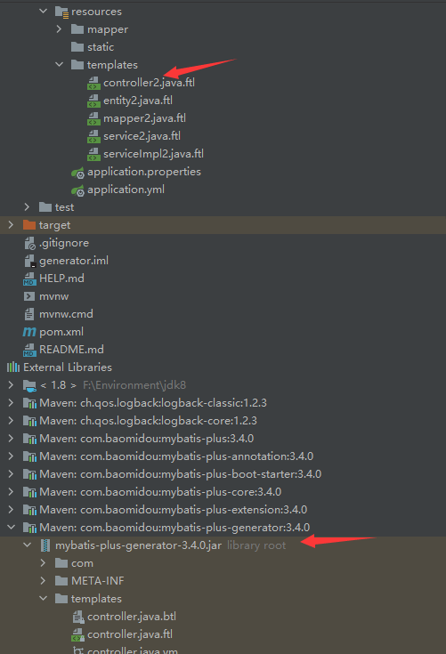

完成

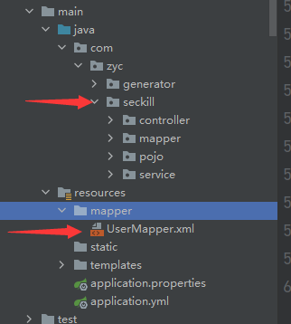

最好一个一个表进行创建，否则文件太多

## 公共返回对象

### 公共返回对象


### 枚举

```java
import lombok.AllArgsConstructor;
import lombok.Getter;
import lombok.ToString;

@Getter
@ToString
@AllArgsConstructor
public enum RespBeanEnum {
    //通用
    SUCCESS(200, "SUCCESS"),
    ERROR(500, "服务端异常"),

    //登录模块
    LOGIN_ERROR(500210, "用户名或者密码不正确"),
    MOBILE_ERROR(500211, "手机号码格式不正确"),
    BIND_ERROR(500212, "参数校验异常"),
    MOBILE_NOT_EXIST(500213, "手机号码不存在"),
    PASSWORD_UPDATE_FAIL(500214, "更新密码失败"),
    SESSION_ERROR(500215, "用户SESSION不存在"),


    //秒杀模块
    EMPTY_STOCK(500500, "库存不足"),
    REPEATE_ERROR(500501, "该商品每人限购一件"),
    REQUEST_ILLEGAL(500502, "请求非法，请重新尝试"),
    ERROR_CAPTCHA(500503, "验证码错误，请重新输入"),
    ACCESS_LIMIT_REACHED(500504, "访问过于频繁，请稍后重试"),
    //订单模块5003xx
    ORDER_NOT_EXIST(500300, "订单不存在"),


    ;

    private final Integer code;
    private final String message;
}
```

状态码和返回信息

## 登录功能

### LoginVo登录传参

### 功能实现

### 手机号校验

### 数据库查询

### 密码校验MD5


## 全局异常捕获

@RestControllerAdvice

https://blog.csdn.net/Colton_Null/article/details/88574923

https://blog.csdn.net/user2025/article/details/105458842


## 完善登录功能

cookie

session

uuid

## 分布式session

两种方法

### 1、spring session

无需增加代码

## 2、redis存储user数据

redisconfig配置类，序列化


## 登录优化

每个连接校验登录

MVC配置类，拦截请求


# 秒杀功能

t_order,t_goods,t_seckill_goods,t_seckill_order表逆向

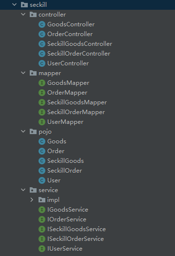

还有mapper文件

## 开发流程

创建返回对象GoodsVo

Controller调用服务goodsService.findGoodsVo()

接口创建findGoodsVo()方法

impl实现findGoodsVo()方法

调用数据库goodsMapper.findGoodsVo()查询方法

mapper接口创建findGoodsVo()方法

mapper.xml写sql语句

## Tip

解决idea从mapper方法直接点进xml文件的问题

去添加mybtis插件

## 商品列表


## 详情页

秒杀前端

定时器

倒计时

按钮

## 秒杀功能实现


# 系统压测

https://blog.csdn.net/a745233700/article/details/117917333

## 标准

### QPS

Queries Per Second，意思是每秒查询率。指一台服务器每秒能够响应的查询次数，用于衡量特定的查询服务器在规定时间内所处理流量多少，主要针对专门用于查询的服务器的性能指标，比如dns，它不包含复杂的业务逻辑处理，比如数据库中的每秒执行查询sql的次数。QPS 只是一个简单查询的统计显然，不能描述增删改等操作，显然它不够全面，所以不建议用 QPS 来描述系统整体的性能；

QPS 基本类似于 TPS，但是不同的是，对于一个事务访问，会形成一个 “ T ”；但一次 " T " 中，可能产生多次对服务器的请求，服务器对这些请求，就可计入 QPS 之中。

### TPS

Transactions Per Second，意思是每秒事务数。一个事务是指客户端向服务器发送请求然后服务器做出反应的过程，具体的事务定义，可以是一个接口、多个接口、一个业务流程等等。以单接口定义为事务举例，每个事务包括了如下3个过程：

（1）向服务器发请求
（2）服务器自己的内部处理（包含应用服务器、数据库服务器等）
（3）服务器返回结果给客户端
如果每秒能够完成 N 次以上3个过程，TPS 就是 N。

TPS 是软件测试结果的测量单位。我们在进行服务性能压测时，接口层面最常关注的是最大 TPS 以及接口响应时间，个人理解 TPS 可以指一组逻辑相关的请求，而服务整体处理能力取决于处理能力最低模块的TPS值。

### 区别：

（1）如果是对一个查询接口压测，且这个接口内部不会再去请求其它接口，那么 TPS = QPS，否则，TPS ≠ QPS

（2）如果是容量场景，假设 N 个接口都是查询接口，且这个接口内部不会再去请求其它接口，QPS = N * TPS

## 压力测试

瞎教，用get装cookie，根本不能这样用

### 秒杀接口

windows ：1800

Linux：1700


# 页面优化

## 页面缓存

不怎么变更的页面

手动渲染

## 对象缓存

已经在之前进行user的缓存

但是如果用户变更，怎样更新缓存

## 页面静态化

### 商品详情页

ajax

数据传输对象（*DTO*）(Data Transfer Object) 类似于Vo

### 秒杀静态化

### 静态资源处理

```
#静态资源处理
resources:
  #启动默认静态资源处理，默认启动
  add-mappings: true
  cache:
    cachecontrol:
      #缓存响应时间，单位秒
      max-age: 3600
  chain:
    #资源配链启动缓存，默认启动
    cache: true
    #启动资源链，默认禁用
    enabled: true
    #启用压缩资源（gzip，brotil）解析，默认禁用
    compressed: true
    #启用h5应用缓存，默认禁用
    html-application-cache: true
  static-locations: classpath:/static/
```

## 解决超卖

用户id+商品id的唯一索引，解决同一用户秒杀多个商品（可能过时了）

用mybatis-plus的更新语句，更新语句添加判断库存是否为零，数据库自带行锁


# 服务优化

RabbitMQ接口优化

redis库存预先扣减

给RabbitMQ发送订单


内存标记

```java
private Map<Long, Boolean> emptyMap = new HashMap<>();
```

redis分布式锁

https://blog.csdn.net/m0_58567231/article/details/122707817

lua脚本


# 安全优化

## 接口隐藏

拼接接口放入redis，秒杀开始

校验接口地址

## 验证码

## 限流

### 漏桶算法

解决大流量

### 令牌桶算法

解决小流量


## 通用限流

写注解

线程变量ThreadLocal

# ——补充——

# 精华

全局异常

分布式session

MVC获取全局获取user信息

页面缓存 或 页面静态化

登录学习过程：全局参数解析器添加用户数据 -->登陆拦截器 -->注解开发

# 补充

## 请求拦截功能

设置一个拦截器

## 登录功能

没有真实登录功能

需要jwt


# 问题

GoodsVo可能有问题，子类不能继承父类私有属性

## 源代码中的错误

前端刷新会添加空ticket

goodsList跳转详情页url错误


# Bug

排除bug的方法：如果在网上找不到，大功率是复制代码的问题，很脑残

## Bug1 登录完全被拦截，MVC配置类出问题

### 心得

前端的bug才是后端的噩梦。根本debug不出来

### 核心问题

大bug：前端代码刷新时会自动添加一个cookie

小bug：忘记把ticket交给Resp

### 解决过程

debug：拿不到ticket

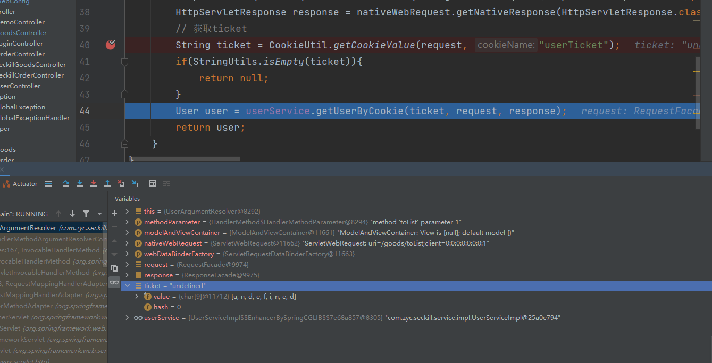

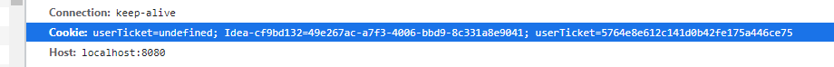

redis里存在

拿不到cookie里面的值

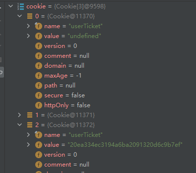

Cookie中出现两个同名key和value的cookie

https://www.h5w3.com/171194.html

但是path不相同

这里刷新页面会自动发cookie

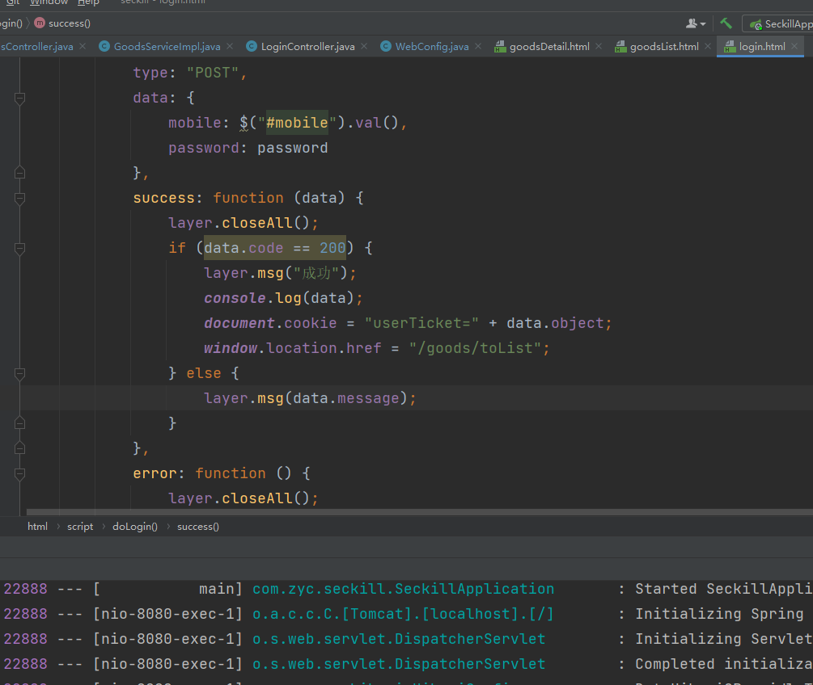

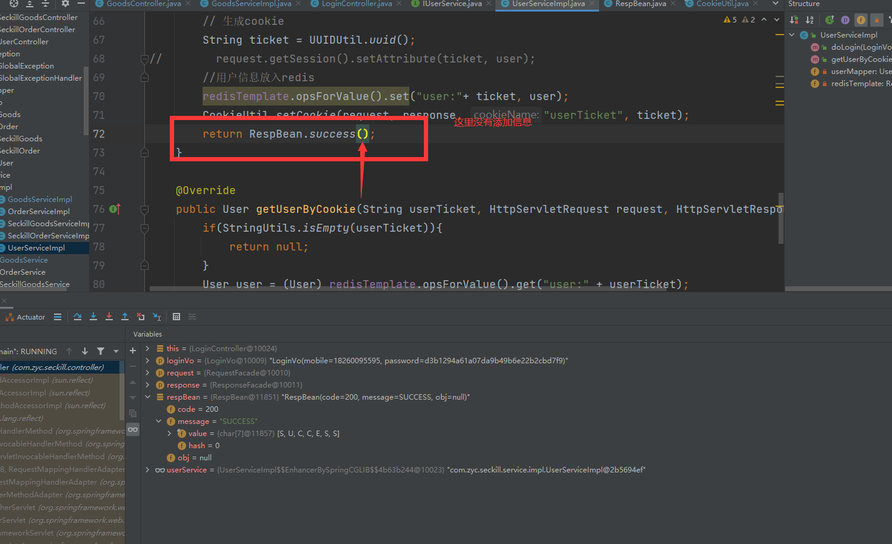

ResqBean没有加ticket，但是还没解决

可能ticket是空值

前端问题刷新时会添加空的ticket

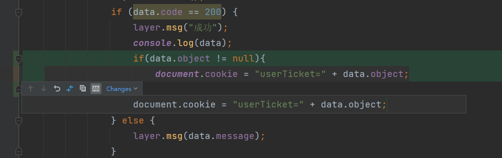

## Bug 2 Linux cookie不输出

https://bbs.csdn.net/topics/390150389

终于解决了，问题是linux服务器上的时间不正确，而cookie保存的时间是1天

但我设置的是-1，不是这个问题，是服务端没有发cookie，没有到达前端


是他cookieutil有问题，域名截取出错

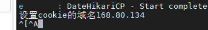

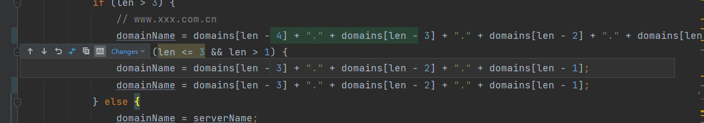

## Bug 3 data.object拿不到数据

前端问题


# ——底部——