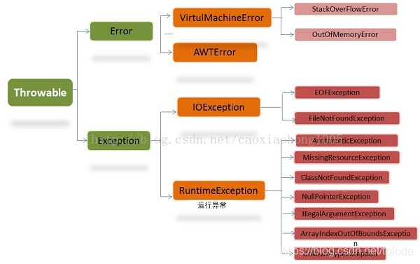
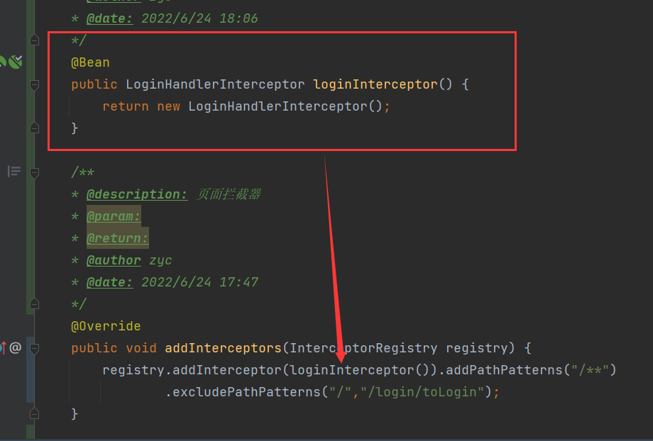
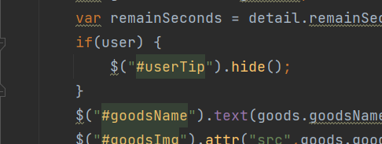

# 第一天

## @Mapper注解：

作用：在接口类上添加了@Mapper，在编译之后会生成相应的接口实现类
添加位置：接口类上面

## @MapperScan

作用：指定要变成实现类的接口所在的包，然后包下面的所有接口在编译之后都会生成相应的实现类
添加位置：是在Springboot启动类上面添加，

添加@MapperScan(“com.winter.dao”)注解以后，com.winter.dao包下面的接口类，在编译之后都会生成相应的实现类

注释

https://yangzhenyu.blog.csdn.net/article/details/122949932

## @Component

https://blog.csdn.net/qq_37606901/article/details/91357882

@component （把普通pojo实例化到spring容器中，相当于配置文件中的 <bean id="" class=""/>）
泛指各种组件，就是说当我们的类不属于各种归类的时候（不属于@Controller、@Services等的时候），我们就可以使用@Component来标注这个类。


## @Slf4j

https://blog.csdn.net/cslucifer/article/details/80953400

@Slf4j是用作日志输出的，一般会在项目每个类的开头加入该注解，如果不写下面这段代码，并且想用log

> [private](https://so.csdn.net/so/search?q=private&spm=1001.2101.3001.7020) final Logger logger = LoggerFactory.getLogger(当前类名.class);

就可以用@Slf4来代替;这样就省去这段很长的代码。

## @ResponseBody

@ResponseBody的作用其实是将java对象转为json格式的数据。

@responseBody注解的作用是将controller的方法返回的对象通过适当的转换器转换为指定的格式之后，写入到response对象的body区，通常用来返回JSON数据或者是XML数据。
注意：在使用此注解之后不会再走视图处理器，而是直接将数据写入到输入流中，他的效果等同于通过response对象输出指定格式的数据。

## @Data

在实体类上添加@Data注解，可以省去代码中大量的 get()、 set()、 toString() 等方法，提高代码的简洁：

## @RestController 

@RestController 是@controller和@ResponseBody 的结合

@Controller 将当前修饰的类注入SpringBoot IOC容器，使得从该类所在的项目跑起来的过程中，这个类就被实例化。
@ResponseBody 它的作用简短截说就是指该类中所有的API接口返回的数据，甭管你对应的方法返回Map或是其他Object，它会以Json字符串的形式返回给客户端

# 第二天

## Matcher & Pattern

https://blog.csdn.net/weixin_42868638/article/details/82721489

正则匹配

Pattern类用于创建一个正则表达式，也可以说是创建一个匹配模式，可以通过两个静态方法创建：compile(String regex)和compile(String regex,int flags)，其中regex是正则表达式，flags为可选模式(如：Pattern.CASE_INSENSITIVE 忽略大小写)

Pattern类中的matcher(CharSequence input)会返回一个Matcher对象。

Matcher类提供了对正则表达式的分组支持,以及对正则表达式的多次匹配支持，要想得到更丰富的正则匹配操作,那就需要将Pattern与Matcher联合使用。


## @Repository

@repository跟@Service,@Compent,@Controller这4种注解是没什么本质区别,都是声明作用,取不同的名字只是为了更好区分各自的功能

@repository是用来注解接口,如下图:这个注解是将接口BookMapper的一个实现类(具体这个实现类的name叫什么,还需要再分析源码找找看)交给spring管理(在spring中有开启对@repository注解的扫描),当哪些地方需要用到这个实现类作为依赖时,就可以注入了.

## 自定义注解的写法

```java
@Target({ElementType.METHOD, ElementType.FIELD, ElementType.ANNOTATION_TYPE, ElementType.CONSTRUCTOR, ElementType.PARAMETER, ElementType.TYPE_USE})
@Retention(RetentionPolicy.RUNTIME)
@Documented
@Constraint(
        validatedBy = {
                IsMobileValidator.class
        }
)
public @interface IsMobile {
    // 默认必填
    boolean required() default true;

    String message() default "手机号码格式错误";

    Class<?>[] groups() default {};

    Class<? extends Payload>[] payload() default {};
}
```


## @RestControllerAdvice

@RestControllerAdvice是什么
@RestControllerAdvice是一个组合注解，由@ControllerAdvice、@ResponseBody组成，而@ControllerAdvice继承了@Component，因此@RestControllerAdvice==本质上是个Component==，用于定义@ExceptionHandler，@InitBinder和@ModelAttribute方法，适用于所有使用@RequestMapping方法。

@RestControllerAdvice的特点：

通过@ControllerAdvice注解可以将对于控制器的全局配置放在同一个位置。
注解了@RestControllerAdvice的类的方法可以使用@ExceptionHandler、@InitBinder、@ModelAttribute注解到方法上。
@RestControllerAdvice注解将作用在所有注解了@RequestMapping的控制器的方法上。
@ExceptionHandler：用于指定异常处理方法。当与@RestControllerAdvice配合使用时，用于全局处理控制器里的异常。
@InitBinder：用来设置WebDataBinder，用于自动绑定前台请求参数到Model中。
@ModelAttribute：本来作用是绑定键值对到Model中，当与@ControllerAdvice配合使用时，可以让全局的@RequestMapping都能获得在此处设置的键值对

## @ExceptionHandler介绍

```
@ExceptionHandler注解我们一般是用来自定义异常的。
可以认为它是一个异常拦截器（处理器）。
```

https://blog.csdn.net/tolode/article/details/103263528



## instanceof

**`instanceof` 是 Java 的保留关键字，它的作用是测试它左边的对象是否是它右边的类的实例，返回 `boolean` 的数据类型**

**基本类型不能用于 `instanceof` 判断**.

https://blog.csdn.net/dreaming_coder/article/details/115430796


## request.getSession().setAttribute()

request.getSession().setAttribute(“绑定名”,绑定值);
这段代码的意思就是：获取session对象,然后把要绑定对象/值 绑定到session对象上
用户的一次会话共享一个session对象


## @CookieValue

```
public String toList(HttpSession session, Model model, @CookieValue("userTicket") String ticket)
```

**@cookieValue是springMvc中的注解：**

@CookieValue的作用

　　用来获取Cookie中的值

## spring boot中慎用@EnableWebMvc

https://www.dandelioncloud.cn/article/details/1498536024430157826

@EnableWebMvc开启后，意味着springmvc环境被你完全接管了（若不定义需要那些bean，确实啥都没有）。而WebMvcAutoConfiguration原本是自动装配的（注入一系列mvc的bean），影响它失效最重要的原因在于：@ConditionalOnMissingBean(WebMvcConfigurationSupport.class) ，是的，正是Condition发挥了的作用（Ioc容器中已经有了WebMvcConfigurationSupport，那WebMvcAutoConfiguration就不会再实例化注入）。

那如果我真的要使用@EnableWebMvc的话，这推荐：

- @EnableWebMvc+extends WebMvcConfigurerAdapter，在扩展的类中重写父类的方法即可（想想xml的时代缺啥加啥）


# 第三天

## 所有属性可以被继承吗

子类不能继承父类的私有属性，但是如果子类调用父类方法影响到了父类私有属性，那么私有属性是能够被子类使用的。

## 遇到第一个bug

前端刷新会添加一个空ticket的cookie

## Mybatis-Plus使用

还不会使用

# 第四天

## ThymeleafViewResolver渲染

```
@Autowired
private ThymeleafViewResolver viewResolver;
```

## @ResponseBody 重定向

好像不能

## 重新制作请求拦截功能

不能傻乎乎的用

## 解决redis在拦截器中无法注入,报空指针问题

https://blog.csdn.net/leibaoxue/article/details/124306602

在拦截器中注入redisTemplate出现空指针是因为拦截器是最先执行的，还未初始化bean，所以要在拦截器执行前将注入bean



## 拦截器拦截静态资源问题

分开拦截

```java
.addPathPatterns("/goods/*","/order/*", "/seckill/*")
```

## 前端隐藏元素




## 前端符号总结

https://blog.csdn.net/qq_42614414/article/details/117459961


# 问题

## springboot的常用注解

## session到底是什么

## redisconfig配置类，序列化

## SpringBoot自动配置原理

https://www.bilibili.com/video/BV1PE411i7CV?p=18

# IDEA小妙招

## 配置注释模板(详细)

https://blog.csdn.net/weixin_38316697/article/details/122949932

## MVC配置类跳转

https://www.bilibili.com/video/BV1PE411i7CV?p=19

## IDEA自动生成对象所有set方法

https://www.csdn.net/tags/MtTakg3sOTY1NTctYmxvZwO0O0OO0O0O.html

这个方法需要整理成小妙招